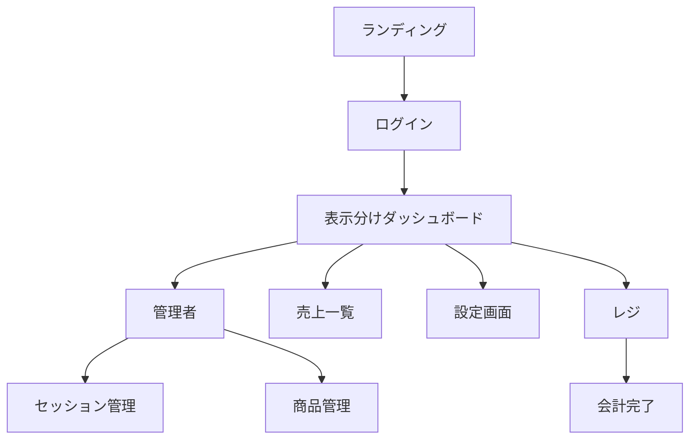
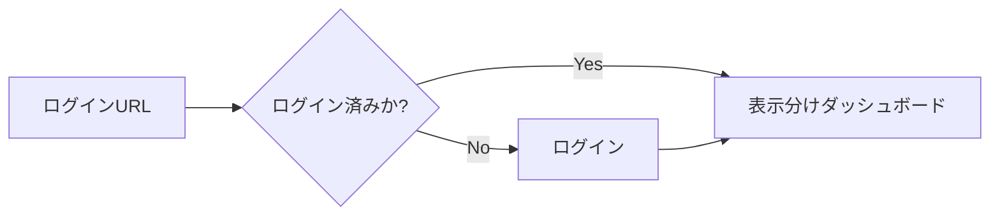
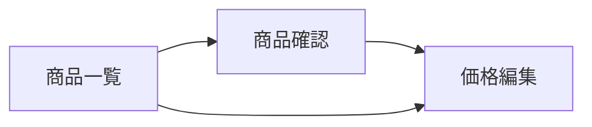
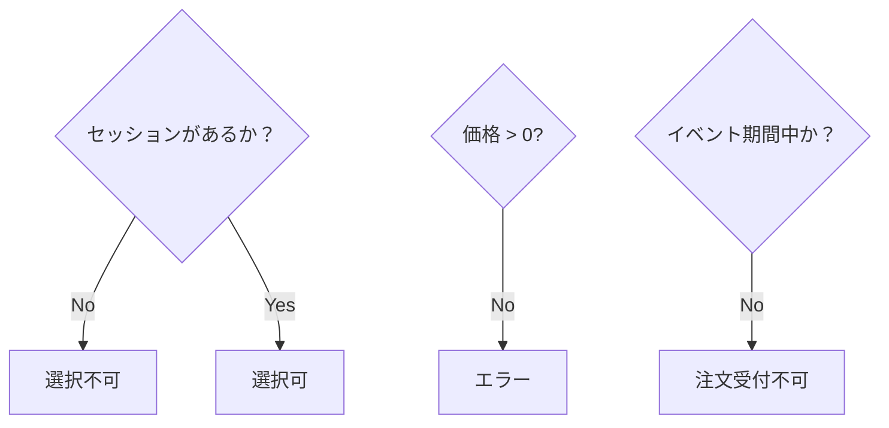
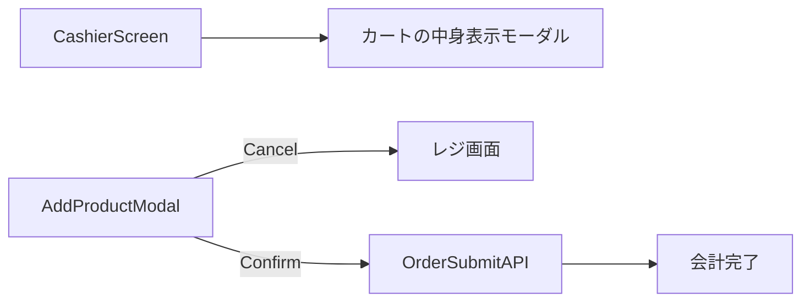
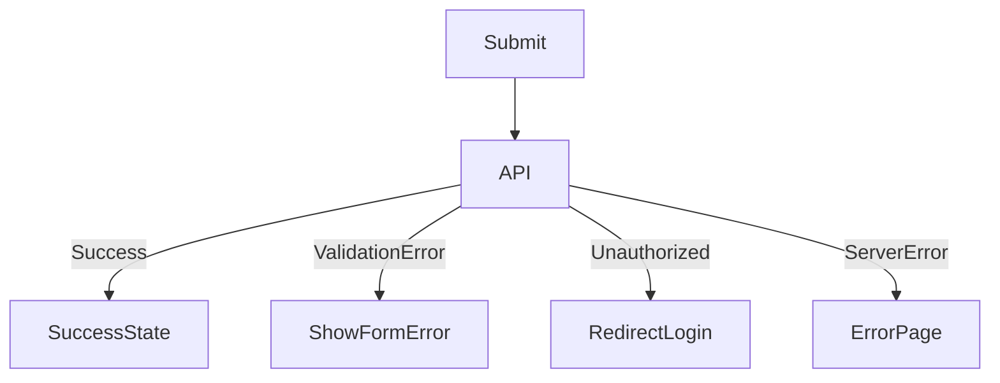
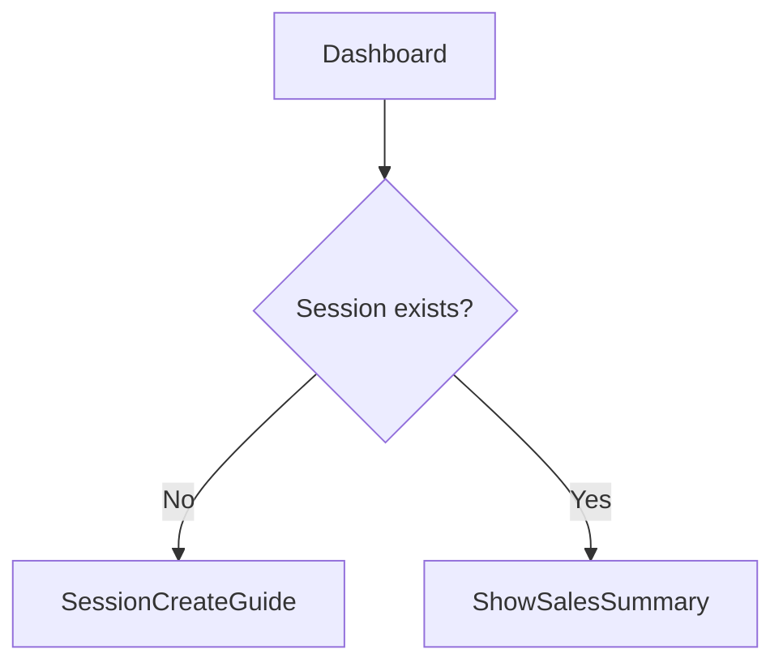

# 🖥️ screen-flow.md テンプレート

---

# 0️⃣ 設計前提

| 項目         | 内容                                 |
| ------------ | ------------------------------------ |
| 対象ユーザー | 文化祭会計担当（一般レジ係 / admin） |
| デバイス     | 基本mobile、PCも一応用意             |
| 認証要否     | 全面認証制                           |
| 権限制御     | RBAC（admin / general）              |
| MVP範囲      | P0画面のみ                           |

---

# 1️⃣ 画面一覧（Screen Inventory）

| ID   | 画面名         | 役割                          | 認証                        | 優先度 |
| ---- | -------------- | ----------------------------- | --------------------------- | ------ |
| S-01 | ランディング   | アプリ入口                    | 不要                        | P0     |
| S-02 | ログイン       | Google OAuth認証              | 不要                        | P0     |
| S-03 | ホーム         | ダッシュボード・屋台/展示選択 | 必須(一般とadminで表示分け) | P0     |
| S-04 | レジ画面       | 会計操作中心画面              | 必須                        | P0     |
| S-05 | 会計完了画面   | 完了表示、待機番号表示        | 必須                        | P1     |
| S-06 | 売上一覧       | 各セッションを表示            | 必須(adminは編集可)         | P0     |
| S-07 | 売上詳細       | セッションの詳細を表示        | 必須(adminは編集可)         | P0     |
| S-08 | セッション管理 | 年度設定管理                  | admin                       | P0     |
| S-09 | 商品管理       | 商品登録・価格設定            | admin                       | P0     |
| S-10 | 設定画面       | ユーザー設定                  | 必須                        | P1     |

---

# 2️⃣ 全体遷移図（高レベル）



---

# 3️⃣ 認証フロー



---

# 4️⃣ CRUD標準遷移テンプレ



---

# 5️⃣ 状態別分岐（State-based Flow）



---

# 6️⃣ 権限別分岐（RBAC/ABAC）

```mermaid
flowchart TD
    RoleCheck{ユーザー権限}

    RoleCheck -->|general| ダッシュボード（屋台/展示選択ボタンのみ表示）
    RoleCheck -->|admin| ダッシュボード（一般に加え、セッション・商品管理）
```

---

# 7️⃣ モーダル・非同期操作



---

# 8️⃣ エラーフロー



---

# 9️⃣ 空状態 / 初回体験



---

# 12️⃣ URL設計テンプレ

```
/login
/cashier
/dashboard
/admin/session
/admin/product
/settings
```
