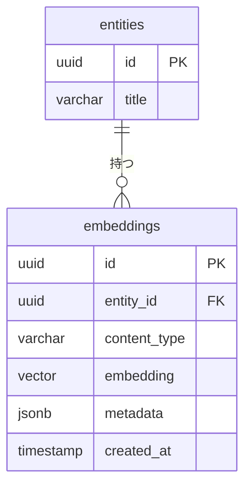
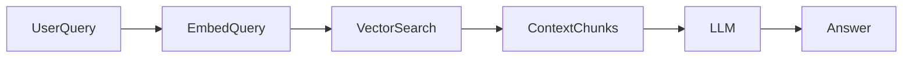

# 🗄️ DB設計書テンプレート

---

# 0️⃣ 設計観点

| 項目       | 内容     |
| ---------- | -------- |
| 権限モデル | RBAC     |
| ID戦略     | UUID     |
| 論理削除   | 有       |
| 監査ログ   | 簡易実装 |

---

# 1️⃣ テーブル一覧テンプレート

| ドメイン   | テーブル名     | 役割                 | Phase |
| ---------- | -------------- | -------------------- | ----- |
| アカウント | users          | ユーザー主体         | P0    |
| 認可       | roles          | ロール定義           | P0    |
| 認可       | user_roles     | ロール付与           | P0    |
| 組織       | circles        | サークル単位管理     | P0    |
| 組織       | circle_members | 所属関係             | P0    |
| イベント   | event_sessions | 文化祭セッション管理 | P0    |
| 商品       | products       | 商品マスタ           | P0    |
| 売上       | orders         | 注文ヘッダ           | P0    |
| 売上       | order_items    | 注文明細             | P0    |
| ログ       | logs           | 操作ログ             | P1    |

---

# 2️⃣ ERDテンプレート（抽象版）

```mermaid
erDiagram

users {
    uuid id PK
    string email
    string name
    timestamp created_at
}

roles {
    smallint id PK
    string name
    smallint level
}

user_roles {
    uuid user_id
    smallint role_id
}

circles {
    uuid id PK
    string name
}

circle_members {
    uuid user_id
    uuid circle_id
}

event_sessions {
    uuid id PK
    uuid circle_id
    date start_date
    date end_date
    string session_name
    timestamp created_at
}

products {
    uuid id PK
    uuid circle_id
    string name
    int price
    boolean active
}

orders {
    uuid id PK
    uuid session_id
    uuid user_id
    int total_price
    timestamp created_at
    timestamp sold_at
}

order_items {
    uuid id PK
    uuid order_id
    uuid product_id
    int quantity
    int price_at_time
}

    users ||--o{ user_roles
    users ||--o{ circle_members
    roles ||--o{ user_roles
    circles ||--o{ circle_members
    circles ||--o{ event_sessions
    event_sessions ||--o{ orders
    orders ||--o{ order_items
    products ||--o{ order_items
```

---

# 3️⃣ カラム定義テンプレート

## users

| カラム     | 型        | 制約               | 説明           |
| ---------- | --------- | ------------------ | -------------- |
| id         | UUID      | PK                 | ユーザーID     |
| email      | VARCHAR   | UNIQUE　　　　　　 | メールアドレス |
| name       | VARCHAR   | NOT NULL           | 表示名         |
| created_at | TIMESTAMP | NOT NULL           | 作成日時       |
| updated_at | TIMESTAMP | NOT NULL           |                |

---

## roles

| カラム     | 型       | 制約     | 説明                     |
| ---------- | -------- | -------- | ------------------------ |
| id         | SMALLINT | PK       | ロールID                 |
| circle_id  | VARCHAR  | UNIQUE   | ロール名                 |
| start_date | SMALLINT | NOT NULL | 権限強度(大きいほど強い) |

---

## user_roles

| カラム     | 型        | 制約         | 説明     |
| ---------- | --------- | ------------ | -------- |
| user_id    | UUID      | FK(users.id) | ユーザー |
| role_id    | SMALLINT  | FK(users.id) | ロール   |
| granted_at | TIMESTAMP | NOT NULL     | 付与日時 |

---

## circles

| カラム     | 型        | 制約     | 説明       |
| ---------- | --------- | -------- | ---------- |
| id         | UUID      | PK       | サークルID |
| name       | VARCHAR   | NOT NULL | サークル名 |
| created_at | TIMESTAMP | NOT NULL | 作成日時   |

---

## circle_members

| カラム    | 型        | 制約         | 説明         |
| --------- | --------- | ------------ | ------------ |
| user_id   | UUID      | FK(users.id) | ユーザー     |
| circle_id | UUID      | FK(users.id) | サークル     |
| role      | VARCHAR   | NOT NULL     | メンバー役割 |
| joined_at | TIMESTAMP | NOT NULL     | 参加日時     |

---

## event_sessions

| カラム       | 型        | 制約           | 説明                           |
| ------------ | --------- | -------------- | ------------------------------ |
| id           | UUID      | PK             | セッションID                   |
| circle_id    | UUID      | FK(circles.id) | サークル                       |
| session_name | VARCHAR   | NOT NULL       | セッション名（例：2025文化祭） |
| start_date   | DATE      | NOT NULL       | 開始日                         |
| end_date     | DATE      | NOT NULL       | 終了日                         |
| created_at   | TIMESTAMP | NOT NULL       | 作成日時                       |

制約：start_date ≤ end_date

---

## products

| カラム     | 型        | 制約           | 説明           |
| ---------- | --------- | -------------- | -------------- |
| id         | UUID      | PK             | 商品ID         |
| circle_id  | UUID      | FK(circles.id) | サークル       |
| name       | VARCHAR   | NOT NULL       | 商品名         |
| price      | INTEGER   | NOT NULL       | 当日価格       |
| active     | BOOLEAN   | NOT NULL       | 販売可能フラグ |
| created_at | TIMESTAMP | NOT NULL       | 作成日時       |

※ price = 0は禁止設計（例外処理可能）

---

## orders

| カラム      | 型        | 制約           | 説明         |
| ----------- | --------- | -------------- | ------------ |
| id          | UUID      | PK             | 商品ID       |
| session_id  | UUID      | FK(circles.id) | セッション   |
| user_id     | UUID      | FK(users.id)   | 販売担当     |
| total_price | INTEGER   | NOT NULL       | 合計金額     |
| sold_at     | TIMESTAMP | NOT NULL       | 販売時刻     |
| created_at  | TIMESTAMP | NOT NULL       | 注文登録日時 |

---

## order_items

| カラム        | 型      | 制約           | 説明       |
| ------------- | ------- | -------------- | ---------- |
| id            | UUID    | PK             | 明細ID     |
| order_id      | UUID    | FK(circles.id) | 注文       |
| product_id    | UUID    | FK(users.id)   | 商品       |
| quantity      | INTEGER | NOT NULL       | 数量       |
| price_at_time | INTEGER | NOT NULL       | 購入時価格 |

---

## logs

| カラム     | 型        | 制約           | 説明         |
| ---------- | --------- | -------------- | ------------ |
| id         | UUID      | PK             | ログID       |
| user_id    | UUID      | FK(circles.id) | 操作ユーザー |
| action     | VARCHAR   | NOT NULL       | 操作内容     |
| quantity   | VARCHAR   | NOT NULL       | 対象リソース |
| created_at | TIMESTAMP | NOT NULL       | 記録日時     |

---

# 4️⃣ 権限設計テンプレート

## RBAC

- role.level 比較で許可判定

## ABAC（任意）

```json
{
  "subject.role": "EDITOR",
  "resource.status": "active",
  "environment.time": "<= deadline"
}
```

| テーブル    | 役割     |
| ----------- | -------- |
| policies    | 条件定義 |
| policy_logs | 評価ログ |

以下に、**超汎用DB設計テンプレートへベクトルDB設計を統合した拡張版**を示します。
特定用途（AI推薦・RAG・検索等）に依存しない抽象モデルです。

# 🧠 ベクトルDB設計テンプレート

## アーキテクチャ選択パターン

## A. 同一DB内（pgvector）

```
App
 └── PostgreSQL (RDB + Vector)
```

**メリット**

- トランザクション整合性
- シンプル

**デメリット**

- 大規模時のスケール制限

---

## 外部ベクトルDB分離

```
App
 ├── RDB（メタデータ）
 └── Vector DB（検索専用）
```

**メリット**

- 高速検索・水平スケール
- フィルタリング最適化

**デメリット**

- 整合性管理が必要

## ベクトル格納設計パターン

---

## 🔹 パターン1：既存テーブルに直接持つ（小規模向け）

```sql
ALTER TABLE entities
ADD COLUMN embedding VECTOR(1536);
```

**適用条件**

- 1エンティティ = 1ベクトル
- 更新頻度低い

---

## 🔹 パターン2：専用ベクトルテーブル（推奨）



---

## embeddings テーブル定義テンプレ

| カラム       | 型        | 説明                  |
| ------------ | --------- | --------------------- |
| id           | UUID      | PK                    |
| entity_id    | UUID      | 紐づくリソース        |
| content_type | VARCHAR   | title/body/comment 等 |
| embedding    | VECTOR(N) | ベクトル              |
| metadata     | JSONB     | フィルタ用属性        |
| model_name   | VARCHAR   | 使用モデル            |
| created_at   | TIMESTAMP |                       |

---

# 3️⃣ メタデータ設計（検索フィルタ用）

```json
{
  "group_id": "uuid",
  "status": "active",
  "visibility": "public",
  "language": "ja",
  "created_by": "uuid"
}
```

※ RAGやマルチテナントでは必須

---

# 4️⃣ インデックス設計

## pgvector（Cosine距離）

```sql
CREATE INDEX idx_orders_session
ON orders(session_id);

CREATE INDEX idx_orders_created
ON orders(created_at);

CREATE INDEX idx_products_circle
ON products(circle_id);
```

---

# 5️⃣ クエリテンプレ

## 類似検索（TopK）

```sql
SELECT entity_id, 1 - (embedding <=> :query_vector) AS similarity
FROM embeddings
WHERE metadata->>'group_id' = :group_id
ORDER BY embedding <=> :query_vector
LIMIT 10;
```

---

# 6️⃣ 更新戦略テンプレ

| 戦略         | 説明                   |
| ------------ | ---------------------- |
| 同期更新     | レコード保存時に即生成 |
| 非同期キュー | 保存→Job→生成          |
| 再生成バッチ | モデル変更時に全更新   |

---

# 7️⃣ RAG設計テンプレ



---

## チャンク設計指針

| 項目           | 推奨             |
| -------------- | ---------------- |
| 文字数         | 300〜800 tokens  |
| オーバーラップ | 10〜20%          |
| 単位           | 意味単位（段落） |

---

# 8️⃣ 多ベクトル対応

用途別に分ける：

| 種類                | 例           |
| ------------------- | ------------ |
| semantic_vector     | 本文検索     |
| keyword_vector      | タイトル重視 |
| user_profile_vector | レコメンド   |
| skill_vector        | マッチング   |

```sql
vector_semantic VECTOR(1536),
vector_title VECTOR(1536)
```
