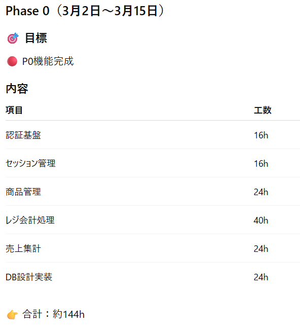
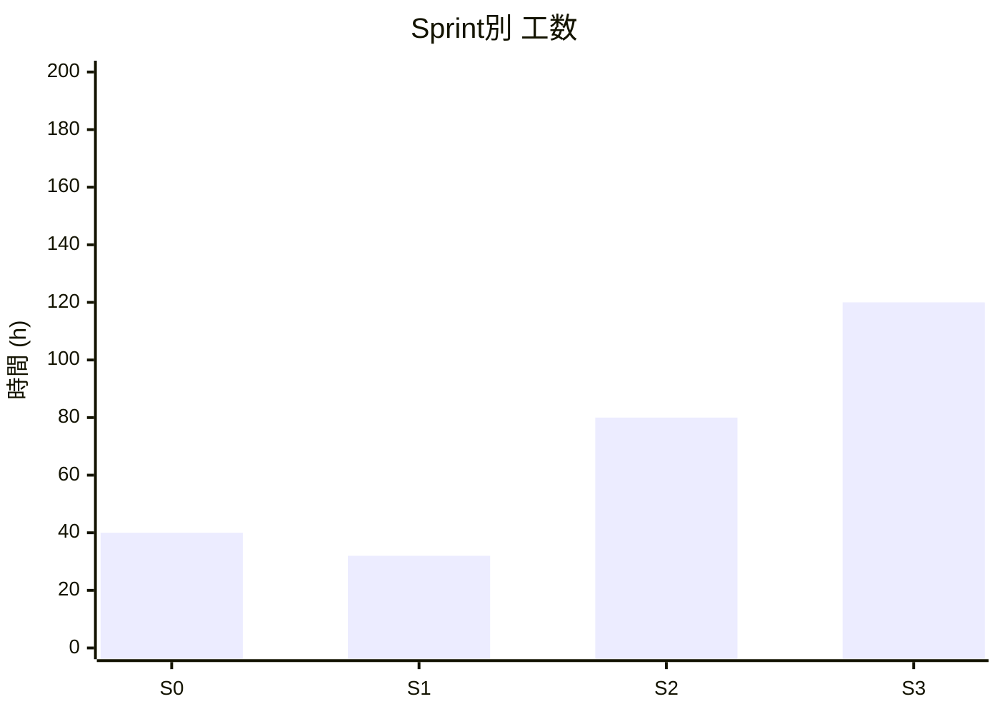
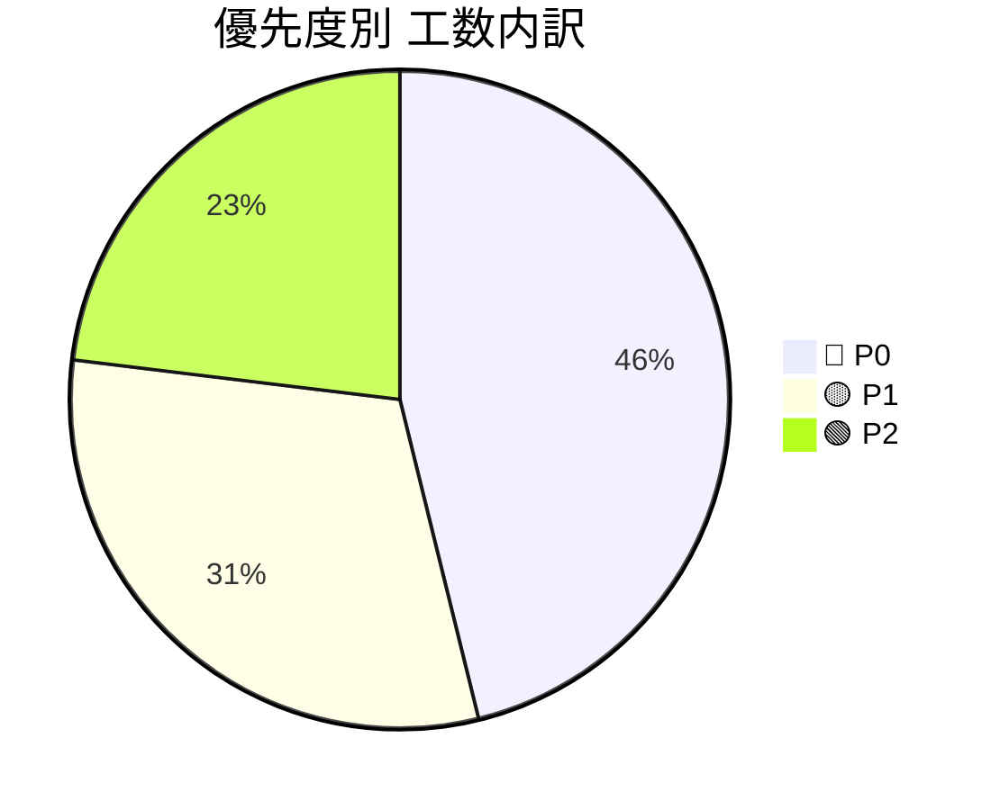
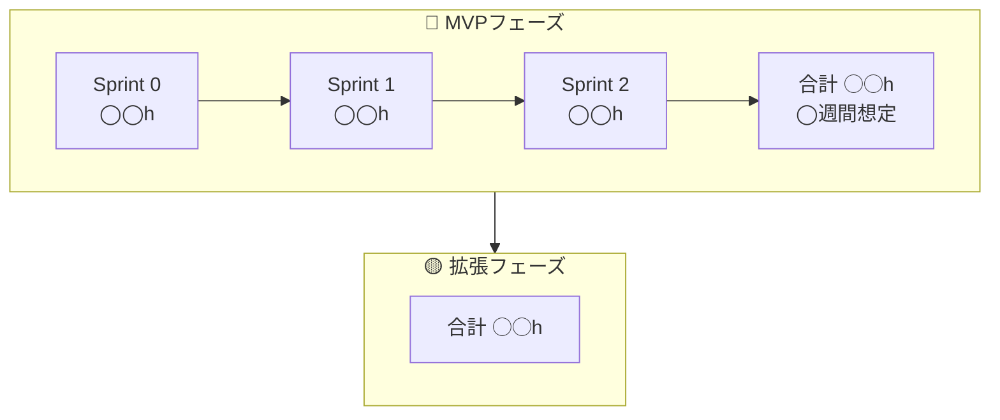

# 🚀 プロジェクトIssue管理テンプレート（工数見積もり付き）

---

## 📌 前提条件

- **1人日 = 8時間**
- 想定チーム規模：1名
- 見積単位：
  - XS = 2h
  - S = 4h
  - M = 8h
  - L = 16h
  - XL = 24h以上

- 優先度ラベル：
  - 🔴 P0：MVP必須
  - 🟡 P1：早期追加
  - 🟢 P2：中期対応
  - ⚪ P3：将来構想

## 3月 スケジュール

| 凡例 | 内容               |
| ---- | ------------------ |
| ○    | 作業可能(5時間)    |
| △    | 作業可能(2～3時間) |
| ×    | 作業不可           |

|     日      |     月      |     火      |     水      |     木      |       金       |     土      |
| :---------: | :---------: | :---------: | :---------: | :---------: | :------------: | :---------: |
|             |             |             |             |             |                | **1**<br>×  |
| **2**<br>△  | **3**<br>○  | **4**<br>○  | **5**<br>○  | **6**<br>○  |   **7**<br>○   | **8**<br>○  |
| **9**<br>○  | **10**<br>○ | **11**<br>○ | **12**<br>○ | **13**<br>○ |  **14**<br>×   | **15**<br>× |
| **16**<br>× | **17**<br>× | **18**<br>× | **19**<br>× | **20**<br>○ |  **21**<br>×   | **22**<br>× |
| **23**<br>× | **24**<br>○ | **25**<br>○ | **26**<br>○ | **27**<br>○ | **28**<br>当日 |   **29**    |
|   **30**    |   **31**    |

---

# 🏁 Sprint別 Issue一覧テンプレート

---

## 🏗️ Sprint X：機能（基盤 / 認証 / コア機能など）

### 🔢 推定合計：



---

# 📊 工数サマリー

## Sprint別工数



---

## 優先度別内訳



---

# 🗓️ フェーズ分解テンプレート



---

# ⏱️ クリティカルパス可視化テンプレート

```mermaid
gantt
    title 主要Issue 工数
    dateFormat X
    axisFormat %s h

    section 基盤
    #001 基盤構築      :0, 16
    #002 DB設計        :0, 16

    section コア機能
    #010 API開発       :crit, 0, 16
    #011 UI開発        :crit, 0, 24
```



---

# 📈 規模感サマリー表

| 区分     | Issue数 | 工数合計 | 並行3名想定 | 並行4名想定 |
| -------- | ------- | -------- | ----------- | ----------- |
| 🔴 MVP   | ◯件     | ◯◯h      | ◯週間       | ◯週間       |
| 🟡 P1    | ◯件     | ◯◯h      | ◯週間       | ◯週間       |
| 🟢 P2    | ◯件     | ◯◯h      | ◯週間       | ◯週間       |
| **合計** | ◯件     | ◯◯h      | ◯週間       | ◯週間       |

---

# 🧮 見積もり計算式（コピー用）

```
総工数 ÷ (人数 × 1日8h × 週5日)
```

例：

```
316h ÷ (4人 × 40h/週) = 約2週間
```

※ レビュー・テスト込みなら ×1.3〜1.5 を推奨

---

# 🎯 実務で使う際の運用ルール

### 1. 見積もり精度向上

- UIはデザイン確定後に再見積
- AI/外部API依存はバッファ20〜30%確保
- 初心者アサイン時は+30%補正

### 2. スプリント設計

- MVPは **P0のみ抽出**
- FE最大工数タスクは早期分解
- API設計 → UI → 結合の順に並べる

### 3. 並行開発最適化

- BE専任1〜2名を確保
- FEはUI集中Sprintを分離
- Infraは最初に完了させる

---

# 🔎 使い方まとめ

1. 全Issueを書き出す
2. 工数ラベルを割り当てる
3. P0のみ抽出 → MVP期間算出
4. 1.3倍補正をかけて現実的スケジュール化
5. クリティカルパスをMermaidで可視化
